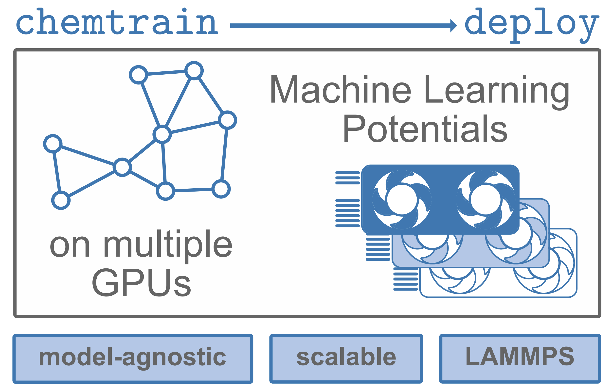

[](https://doi.org/10.1021/acs.jctc.5c00996) [](https://opensource.org/license/mit)

# Supporting Code for <br>_``chemtrain-deploy``: A Parallel and Scalable Framework for Machine Learning Potentials in Million-Atom MD Simulations_


This repository contains the implementation of the experiments presented in the paper:  
[**_chemtrain-deploy: A parallel and scalable framework for machine learning potentials in million-atom MD simulations_**](https://pubs.acs.org/doi/10.1021/acs.jctc.5c00996)

  
_Figure: Table of contents graphic from the paper._

---

## Installation

The core setup and source code for `chemtrain-deploy` are located in the [chemtrain-deploy](https://github.com/tummfm/chemtrain/tree/main/chemtrain-deploy) folder under [chemtrain repository](https://github.com/tummfm/chemtrain).
The code for MACE, Allegro, and PaiNN is adapted in `external/chemutils/models` under the MIT license.

First, install JAX with GPU support by following the [JAX Installation Instructions](https://docs.jax.dev/en/latest/installation.html).
Then, install the required packages for the project located in the `external` directory:

```bash
pip install -e "external/chemtrain[all]"
pip install -e "external/chemutils"
```

---

## Examples

Detailed usage examples can be found in the [`examples/`](examples/) directory.  
We provide demonstrations for:

- Aluminum
- Solvated peptides
- Water slab

---

## Citation

If you use `chemtrain-deploy`, please cite the following works:

```bibtex
@article{fuchsChemtrainDeploy2025,
  title = {Chemtrain-{{Deploy}}: {{A Parallel}} and {{Scalable Framework}} for {{Machine Learning Potentials}} in {{Million-Atom MD Simulations}}},
  author = {Fuchs, Paul and Chen, Weilong and Thaler, Stephan and Zavadlav, Julija},
  year = {2025},
  month = jul,
  journal = {Journal of Chemical Theory and Computation},
  publisher = {American Chemical Society},
  issn = {1549-9618},
  doi = {10.1021/acs.jctc.5c00996}
}

```
```bibtex
@article{fuchs2025chemtrain,
  title = {chemtrain: Learning deep potential models via automatic differentiation and statistical physics},
  author = {Fuchs, Paul and Thaler, Stephan and Röcken, Sebastien and Zavadlav, Julija},
  journal = {Computer Physics Communications},
  volume = {310},
  pages = {109512},
  year = {2025},
  doi = {10.1016/j.cpc.2025.109512},
  url = {https://www.sciencedirect.com/science/article/pii/S0010465525000153},
  issn = {0010-4655}
}
```

## Contact
For questions or discussions, please open an issue on Github.
